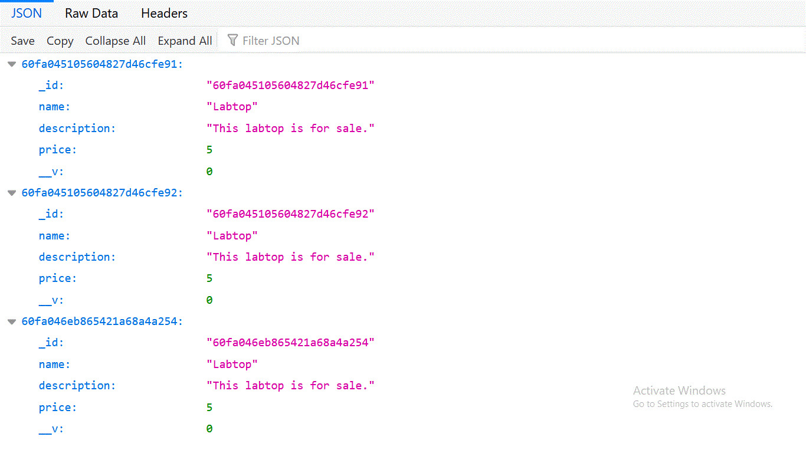

# expressjs_mongo_project
A RESTful API using MongoDB and ExpressJS.


# Tools Used:

1. [Mongoose](https://www.npmjs.com/package/mongoose)
2. [ExpressJS](https://www.npmjs.com/package/express)
2. [Nodemon](https://www.npmjs.com/package/nodemon)


# How To Run:


1. In your mongoDB create a database called "cantiin"  
2. run these commands:


<b>

```bash
npm install
npm start
```

</b>


# Schemas:

There are 2 Schemas.  

## 1) Product:

### Fields:
1. **`_id`**
	- This is the id to access any product
2. **`name`**
	- **Type**: String
	- **`required`**: true
	- **`Minimum Length`**: 3 letters
	- **`Maximum Length`**: 200 letters
3. **`price`**
	- **Type**: Number
	- **`required`**: true
	- **`Minimum Value`**: .01
	- **`Maximum Value`**: 1000000
4. **`description`**
	- **Type**: String
	- **`required`**: true
	- **`Minimum Length`**: 5 letters
	- **`Maximum Length`**: 1000 letters

## 2) Order:

### Fields:


1. **`_id`**
	- This is the id to access any product
2. **`product_id`**
	- **Type**: ObjectId (Relationship with Product)
	- The ID of the Product related to this order
	- The product must exist in the database
3. **`amount`**
	- **Type**: Number
	- **`required`**: true
	- **`Minimum Value`**: .01
	- **`Maximum Value`**: 1000000


# Endpoints:

## A) Ping Endpoint:

### A-1) http://127.0.0.1:3000/
This endpoint will display **`Hello World`**.  
This endpoint is created only to make sure that the project is working.  


## B) Product Endpoints:

### B-1) (GET) http://127.0.0.1:3000/products/
This endpoint will display a list of the products in the database.  
They will be displayed as JSON.  



### B-2) (POST) http://127.0.0.1:3000/products/
This endpoint will add a new product.

### B-3) (GET) http://127.0.0.1:3000/products/:id
This endpoint will display the product with this id.

### B-4) (DELETE) http://127.0.0.1:3000/products/:id
To delete the product with this ID.

### B-5) (PUT) http://127.0.0.1:3000/products/:id
To update the product with this ID.


## C) Order Endpoints:

### C-1) (GET) http://127.0.0.1:3000/orders/
### C-2) (POST) http://127.0.0.1:3000/orders/
### C-3) (GET) http://127.0.0.1:3000/orders/:id
### C-4) (DELETE) http://127.0.0.1:3000/orders/:id
### C-5) (PUT) http://127.0.0.1:3000/orders/:id


